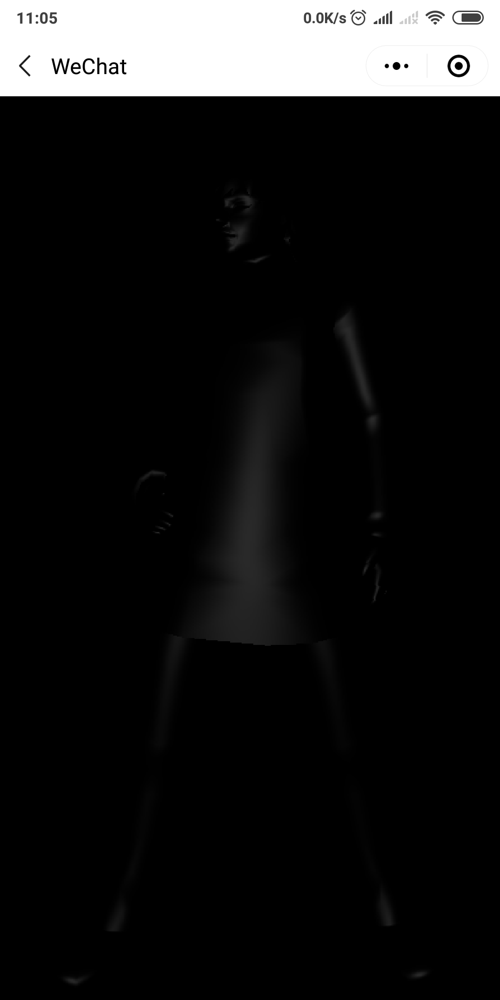

# three.js example

three.js example in wechat miniprogram

----

three.js 在小程序里的使用示例，其中 [three.js](https://github.com/yannliao/three.js) 使用的是小程序移植版，详情请到 [https://github.com/yannliao/three.js](https://github.com/yannliao/three.js)。

## 示例
* 基本。 包含 `BoxBufferGeometry`, `CircleBufferGeometry`, `ConeBufferGeometry`, `CylinderBufferGeometry`, `DodecahedronBufferGeometry` 等基本模型使用。
* OrbitControl 立方。 使用oribitControl控制立方体。
* gLTF。 加载gltf格式模型。
* OBJ。 加载obj格式模型。

## 注意 
由于示例中有较多的模型是使用官网链接，加载比较慢。如果可以请查找替换资源路径，并替换。

## 兼容性

 xiaomi MIX2 Android 8.0.0   Wechat Version 7.0.5   ok 

 vivo X21A Android 9  Wechat Version 7.0.5    ok 

 iphone 8Plus  ios13.1.2  Wechat Version 7.0.8    new gLTF 白屏 
    
## 演示

1. 基本

2. OrbitControl 立方

3. gLTF 文件加载

glb 文件 

gLTF 文件加贴图

4. obj 文件 （WEBGL_compressed_texture_s3tc 扩展不支持）

