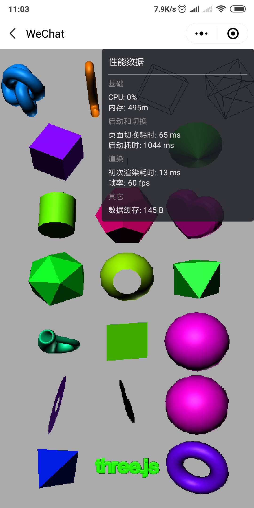
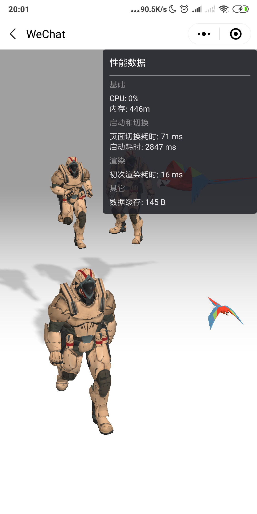
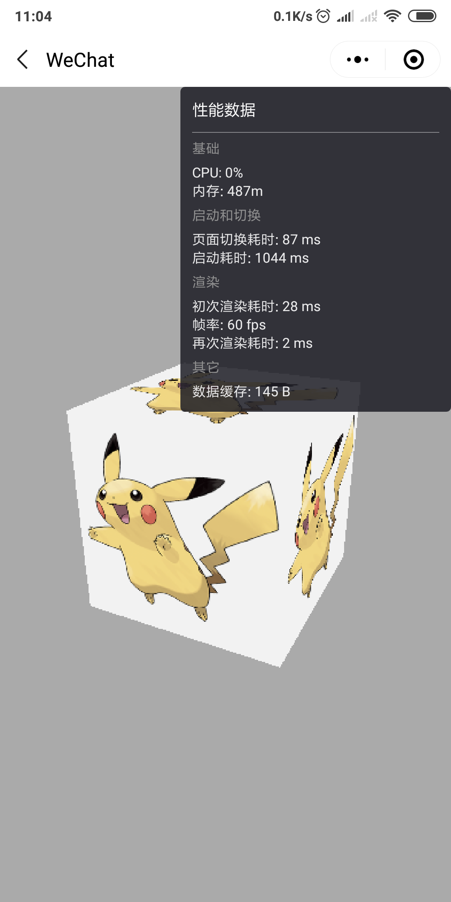
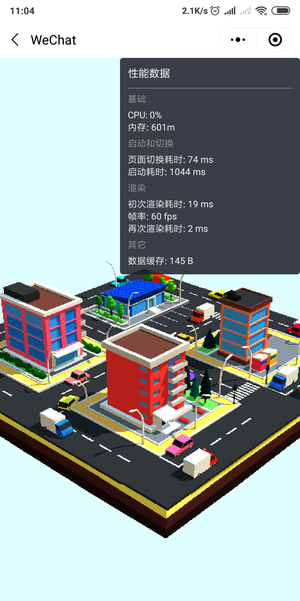
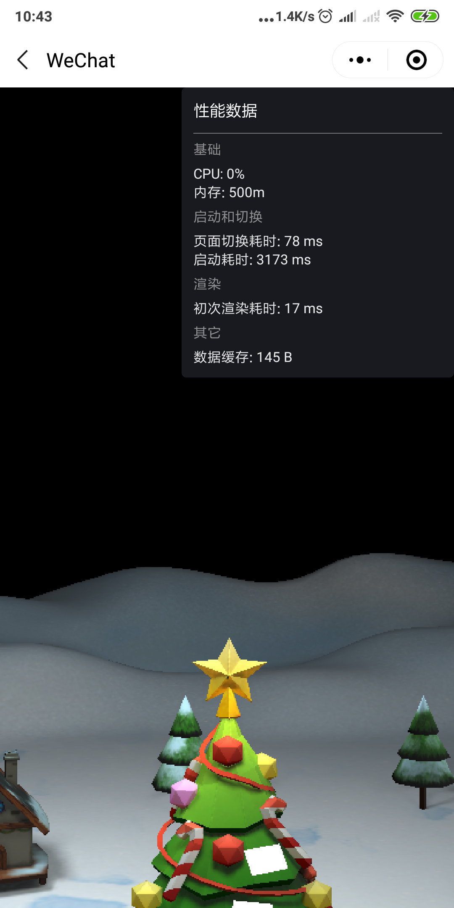
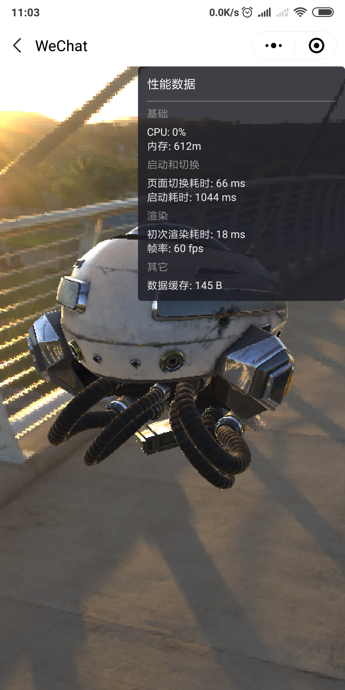
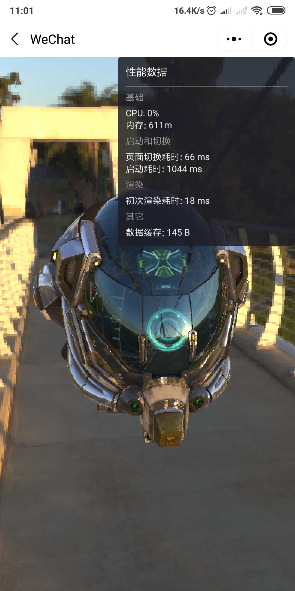
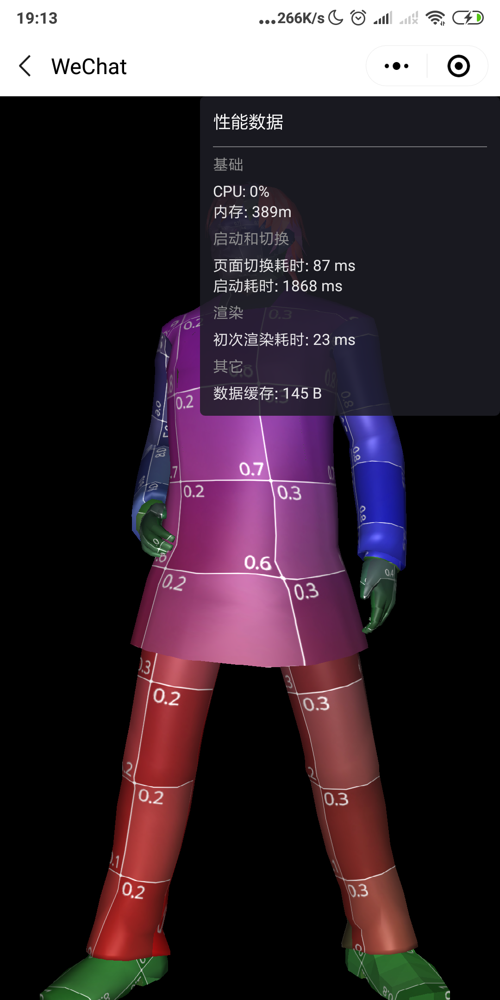
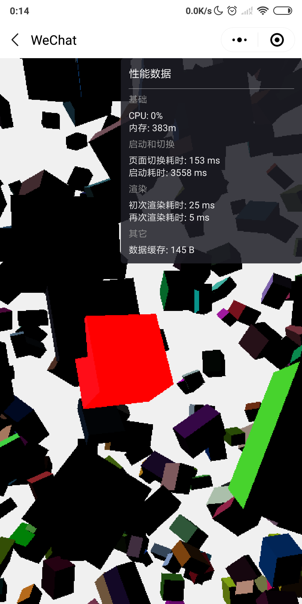

# three.js example

three.js example in wechat miniprogram

----

three.js 在小程序里的使用示例，其中 [three.js](https://github.com/yannliao/three.js) 使用的是小程序移植版，详情请到 [https://github.com/yannliao/three.js](https://github.com/yannliao/three.js)。

## 注意 
1. 由于示例中有较多的模型是使用官网链接，加载比较慢。如果可以请查找替换资源路径，并替换。小程序只可以跟指定的域名与进行网络通信。使用前请[配置信任域名](https://developers.weixin.qq.com/miniprogram/dev/framework/ability/network.html)

2. 内存泄漏。为了防止内存泄漏，请在页面unload时，用 THREE.global.unregisterCanvas 或 THREE.global.clearCanvas 清除THREE.global中的canvas引用。同时利用canvas.cancelAnimationFrame 清除动画， 并且释放 Geometries Materials 等 Three.js 对象， 参考[How to dispose of objects](https://threejs.org/docs/index.html#manual/en/introduction/How-to-dispose-of-objects), [Three.js Cleanup](https://threejsfundamentals.org/threejs/lessons/threejs-cleanup.html)

## 交流
大家可以加入QQ群进行交流，群号： 858741591

## 示例&兼容性

<table>
    <thead>
        <tr>
            <th>名称</th>
            <th>性能</th>
            <th>机型</th>
        </tr>
    </thead>
    <tbody>
        <tr>
            <th>基本</th>
            <th></th>
            <th>
            xiaomi MIX2 Android 8.0.0   Wechat Version 7.0.5  
            vivo X21A Android 9  Wechat Version 7.0.5 
            iphone 8Plus  ios13.1.2  Wechat Version 7.0.8 
            </th>
        </tr>
        <tr>
            <th>动画</th>
            <th>
            
            </th>
            <th>
            xiaomi MIX2 Android 8.0.0   Wechat Version 7.0.5  
            vivo X21A Android 9  Wechat Version 7.0.5 
            iphone 8Plus  ios13.1.2  Wechat Version 7.0.8 
            </th>
        </tr>
        <tr>
            <th>OrbitControl 立方</th>
            <th>
            
            </th>
            <th>
            xiaomi MIX2 Android 8.0.0   Wechat Version 7.0.5  
            vivo X21A Android 9  Wechat Version 7.0.5 
            iphone 8Plus  ios13.1.2  Wechat Version 7.0.8 
            </th>
        </tr>
        <tr>
            <th>gLTF 文件加载</th>
            <th>
            
            </th>
            <th>
            xiaomi MIX2 Android 8.0.0   Wechat Version 7.0.5  
            vivo X21A Android 9  Wechat Version 7.0.5 
            iphone 8Plus  ios13.1.2  Wechat Version 7.0.8 
            </th>
        </tr>
        <tr>
            <th>glb 文件 </th>
            <th>
            
            </th>
            <th>
            xiaomi MIX2 Android 8.0.0   Wechat Version 7.0.5  
            vivo X21A Android 9  Wechat Version 7.0.5 
            iphone 8Plus  ios13.1.2  Wechat Version 7.0.8 
            </th>
        </tr>
        <tr>
            <th>gLTF 文件加贴图 </th>
            <th>
            
            
            </th>
            <th>
            xiaomi MIX2 Android 8.0.0   Wechat Version 7.0.5  
            vivo X21A Android 9  Wechat Version 7.0.5 
            iphone 8Plus ios13.1.2 Wechat Version 7.0.8 
            </th>
        </tr>
        <tr>
            <th>obj 文件 （WEBGL_compressed_texture_s3tc 扩展不支持）</th>
            <th>
            
            </th>
            <th>
            xiaomi MIX2 Android 8.0.0   Wechat Version 7.0.5  
            vivo X21A Android 9  Wechat Version 7.0.5 
            iphone 8Plus  ios13.1.2  Wechat Version 7.0.8 
            </th>
        </tr>
        <tr>
            <th>raycaster 选中立方体</th>
            <th>
            
            </th>
            <th>
            xiaomi MIX2 Android 8.0.0   Wechat Version 7.0.5  
            iphone 8Plus  ios13.1.2  Wechat Version 7.0.8 
            </th>
        </tr>
    </tbody>
</table>
